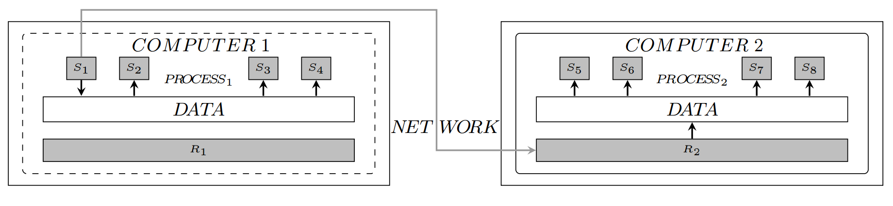

<h1 align="center"> dSyrup </h1>



dSyrup is an original distributed SAT solver based on the portfolio paradigm. This solver, dedicated to work on plenty of cores, implements a new fully hybrid distributed programming model from Syrup. dSyrup uses a hybrid programming model. In hybrid models, processes running on the same computer communicate via shared memory (pthreads) and messages (MPI) are used only to communicate between computers. By default, dSyrup use the concurrent parallel strategy, but we have also implemented the dynamic Divide and Conquer strategy. 

See http://www.cril.univ-artois.fr/dsyrup/ for more details.

People involved in this project:
- Gilles Audemard (audemard@cril.fr)
- Jean-Marie Lagniez (lagniez@cril.fr)
- Nicolas Szczepanski (szczepanski@cril.fr)
- Sébastien Tabary (tabary@cril.fr)


[SAT 2017](http://www.cril.univ-artois.fr/~szczepanski/res/dsyrup.pdf)
[JFPC 2018](https://home.mis.u-picardie.fr/~evenement/JFPC2018/articles/JFPC_2018_papier_3.pdf)

# Installing dSyrup

To install the necessary components :
- Install g++ with c++2011 minimum
- Install an MPI implementation (MPICH2 preferred) 
  with the mode MPI_THREADS_MULTIPLE (Option to enable during the installation of the MPI implementation)
- Install paquets libxml2-dev and pthread 2011

To compile the solver :
```console
make clean
make -j
```

To configure :
- You can change options in the file Config/concurrentSAT.xml. 
  - The number of computers  
  - the number of threads
  - The programming model  
  - ...
- All possibilities for options are described in the file OptionCoding.h. 

# Execution

To launch dSyrup in concurent mode on a computer :
```console
mpirun -np 1 Manager/bin/manager <CNF> Config/concurrentSAT.xml 
```

To launch dSyrup with the dynamic Divide and Conquer mode of Ampharos: 
```console
mpirun -np 1 Manager/bin/manager <CNF> Config/ampharosSAT.xml  
```

To launch with a specific hostfile (launch.sh create the good XML configuration file) :
./launch.sh <CNF>  

If you detect a bug don't hesitate to contact me : szczepanski.nicolas@gmail.com
